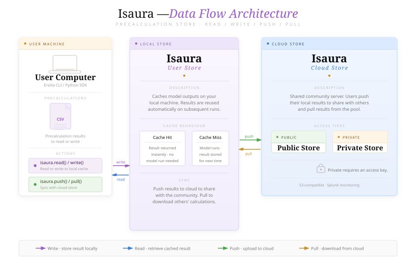

# Results caching

The Ersilia Model Hub utilizes a two-tiered caching system to save computational time and avoid redundant work. By default, all users can leverage lightweight local caching to speed up repeated predictions on their machine. For a more permanent and shared solution, Ersilia maintainers and advanced users can utilize Isaura, our long-term precalculation store.

## 1. Local caching (REDIS)

Ersilia provides built-in caching using [Redis](https://redis.io/) to improve performance by storing model results. This caching system does not target variable outputs from generative models but instead caches various types of model outputs. The cache key is generated by creating an `MD5` hash from the combination of the model ID and its input (e.g., SMILES string). It only supports models which are packed using the FastAPI-based ersilia-pack server (more on this in [Model packaging](/broken/pages/0vyS1r1NF0Qz744t34S4)).

### Caching Features

* Automatic Caching: By default, Ersilia caches model results.
* Key Generation: A unique key is created using an MD5 hash based on the model ID and input.
* Flexibility: Caching can be turned off during server startup if desired.

### Set up and installation

Redis will be installed and set up automatically if Docker is installed and running in your system. Else, caching will be skipped as if the `--enable-cache` flag was used.

### How to Control Caching

When starting the Ersilia server, you can decide whether to use caching with these command-line options:

```bash
ersilia server eos3b5e --enable-cache #default
ersilia server eos3b5e --disable-cache #disables caching
```

#### Memory Management

Redis manages its memory usage based on available system resources. By default, it uses 30% of the system RAM for caching. You can adjust this limit by specifying a different memory usage fraction. Simply replace with the desired fraction of your system's RAM that Redis should use. Recommended range is 0.1-0.7. It uses `AOF` mode with snapshot disabled for better memory usage.

```bash
ersilia serve eos3b5e --max-cache-memory-frac <fraction>
```

## Remove Redis cache

If you are using Ersilia or ZairaChem during testing phases, you may be saving into the cache wrong results. Therefore it is important to delete the volume after testing to make sure the results stored are correct, else for example wrong descriptors would be picked up by the model cache.

To do so, first list all volumes that Redis is using:

```bash
docker volume ls
## result should look something like:
DRIVER    VOLUME NAME
local     configs_nginx_cache
local     configs_redis_data


```

Next identify the Container ID of redis (all redis volumes are associated to this container ID, which needs to be stopped and eliminated before the volumes can be removed)

<pre class="language-bash"><code class="lang-bash">docker ps
## result should look something like:
CONTAINER ID   IMAGE               COMMAND                  CREATED          STATUS                         PORTS                                       NAMES
<strong>ee50428df633   redis:latest        "docker-entrypoint.s…"   11 minutes ago   Up 11 minutes (healthy)        6379/tcp                                    configs-redis-1
</strong>c49ca91b2723   ersiliaos/eos4ywv   "sh /root/docker-ent…"   2 days ago       Up 24 minutes                  0.0.0.0:60569->80/tcp, [::]:60569->80/tcp   configs-eos4ywv_api-1
 
</code></pre>

Stop and eliminate the redis container:

```bash
docker container stop ee50428df633
docker rm ee50428df633
```

Now we are ready to delete ALL redis volumes (no need to delete the Redis image itself):

```bash
docker volume rm configs_redis_data
```

## 2. Precalculation Store (Isaura)

Isaura is Ersilia’s advanced, cloud-ready precalculation store. It is designed to efficiently save model outputs in the standard Ersilia format and serve them back to users, drastically reducing computation time and redundant processing for previously analyzed molecules.

<figure><figcaption></figcaption></figure>

Isaura relies on three core capabilities:

* Efficient Object Storage: It stores massive datasets seamlessly using S3-compatible object storage.
* Exact Lookup: It instantly retrieves cached outputs for inputs that have already been processed by a specific model.
* Approximate Lookup: Using vector search, it can find the "nearest neighbor" (the most structurally similar molecule) to your query and return its cached results, which is highly valuable for finding quick proxies.

### 2.1 Quick Start

Isaura uses [`uv`](https://docs.astral.sh/uv/getting-started/installation/) for fast Python dependency management.



#### Clone and set up

```bash
git clone https://github.com/ersilia-os/isaura.git
cd isaura
uv sync
source .venv/bin/activate
```



#### Start all services

**Prerequisites**

* [Docker](https://www.docker.com/get-started) installed and running
* Docker Compose installed
  * Ubuntu: follow Docker’s install docs
  * macOS: `brew install docker-compose`

**Fastest way**

```bash
isaura engine --start
```



#### Optional: Install MinIO Client (mc)

The MinIO Client (`mc`) is a command-line tool to manage MinIO/S3 storage.

**Install (Linux/macOS)**

```bash
curl -O https://dl.min.io/client/mc/release/linux-amd64/mc
chmod +x mc
sudo mv mc /usr/local/bin/
```

**Or with Homebrew (macOS)**

```bash
brew install minio/stable/mc
```

**Configure `mc`**

```bash
mc alias set local http://localhost:9000 minioadmin123 minioadmin1234
```

Example: list projects (buckets)

```bash
mc ls local
```

MinIO web console:

* [http://localhost:9001](http://localhost:9001/)
* Username: `minioadmin123`
* Password: `minioadmin1234`

More on `mc`: [https://github.com/minio/mc?tab=readme-ov-file](https://github.com/minio/mc?tab=readme-ov-file)



### 2.2 Credentials

To interact with the shared Ersilia Cloud, you must authenticate your local instance by exporting your assigned MinIO access and secret keys as environment variables.

These keys ensure that you have the appropriate read/write permissions for both the public and private project buckets.

**For the Public Cloud Bucket (Read/Write):**

```
export MINIO_CLOUD_AK="" # Access Key 
export MINIO_CLOUD_SK="" # Secret Key
```

**For the Private Cloud Bucket (Read/Write):**

```
export MINIO_PRIV_CLOUD_AK="" # Access Key  
export MINIO_PRIV_CLOUD_SK="" # Secret Key
```


Keep your secret keys secure. Do not hardcode them into scripts that will be committed to public version control repositories (like GitHub).


### 2.3 Command examples

The Isaura CLI is designed to be intuitive. Below are common real-world examples of how to manage your precalculations directly from your terminal.

**🧾 Writing (Uploading) Results**

Upload model outputs to a specific project. _(Note: Your input CSV must contain a column explicitly named `input`)_.

```
isaura write -i data/ersilia_output.csv -m eos8a4x -v v2 -pn myproject --access public
```

**📥 Reading Results (Exact Match)**

Read cached results for a list of inputs and save them directly to an output CSV file.

```
isaura read -i data/inputs.csv -m eos8a4x -v v2 -pn myproject -o data/outputs.csv 
```

**🔁 Reading Results (Approximate Match)**

Fetch results using approximate search. This uses Milvus to find the top-1 most similar input if an exact match isn't found.

```
isaura read -i data/inputs.csv -m eos8a4x -v v2 -pn myproject -o data/outputs.csv -nn
```

### ☁️ Cloud Sync

Isaura makes it easy to seamlessly synchronize your precalculated results between your local machine and the shared Ersilia cloud.

#### Pull (Cloud → Local)

If you want to download existing calculations from the cloud to your local instance, use the `pull` command. This is especially useful for fetching public results to speed up your local models without having to run the calculations from scratch.

```
isaura pull -m eos8a4x -v v1 -pn isaura-public -i data/inputs.csv
```

#### Push (Local → Cloud)

Once you have computed new outputs locally, you can upload them directly to the cloud store using the `push` command. This makes your calculations permanently available to other users or simply acts as a secure backup for your own custom project.

```
isaura push -m eos8a4x -v v1 -pn myproject
```
